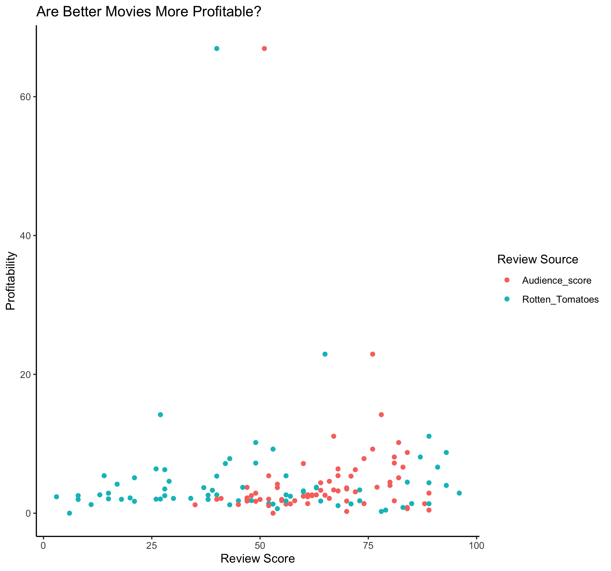
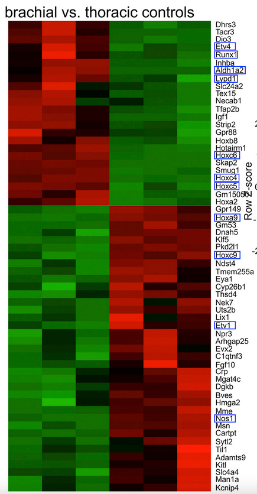

```{r setup, include=FALSE}
knitr::opts_chunk$set(echo = TRUE)
library(dplyr)
library(ggplot2)

#New library!
library(tidyr)
```

## Function cheatsheet

#### Base R

```r
mean()
sum()
head()
tail()
length()
dim()
as.numeric()
as.character()
typeof()
unique() - NEW - prints each categorical value only once (so the unique of c(1,2,2,4,5,5,5,8) would be 1,2,4,5,8)
```

#### Dplyr
```r
filter()
group_by()
summarize()
na.omit()
mutate() - NEW - adds a new column based on the arguments within
transmute() - NEW - adds a new column based on the arguments within and then selects only that column
```

#### Ggplot2
```r
ggplot()
aes()
geom_point()
geom_density()
geom_count()
geom_bar()
ggtitle()
xlab()
ylab()
geom_hline() - NEW - makes a horizontal line at the y intercept specified
geom_vline()- NEW - makes a vertical line at the x intercept specified
ylim() - NEW - takes in two numbers as the limits for the y axis
xlim() - NEW - takes in two numbers as the limits for the x axis
```

## Advanced cheatsheets

- [Master repository by RStudio](https://github.com/rstudio/cheatsheets)
- [Base R](https://github.com/rstudio/cheatsheets/blob/main/base-r.pdf)
- [(Mostly) dplyr](https://www.rstudio.com/wp-content/uploads/2015/02/data-wrangling-cheatsheet.pdf)
- [dplyr: Transformation](https://github.com/rstudio/cheatsheets/blob/main/data-transformation.pdf)
- [ggplot2](https://github.com/rstudio/cheatsheets/blob/main/data-visualization.pdf)
- [tidyr](https://github.com/rstudio/cheatsheets/blob/main/tidyr.pdf)


## Quick recap

```{r}
penguins <- read.csv("penguins.csv")

#We can use dplyr's piping to filter by specific variables
penguins %>% filter(species == "Adelie") %>% head()
penguins %>% filter(species == "Adelie") %>% ggplot(aes(x = sex)) + geom_bar()

#We can also get summary statistics using summarize
penguins %>% na.omit() %>%
  group_by(species, sex) %>%
  summarize(bill_length_mean = mean(bill_length_mm)) 

#And then pipe this into a plot
penguins %>% na.omit() %>%
  group_by(species, sex) %>%
  summarize(bill_length_mean = mean(bill_length_mm)) %>%
  ggplot(aes(x = sex, y = bill_length_mean, color = species)) +
  geom_point()
```

## Review Practice

```{r}
#### Practice dataset
# Load the Hollywood data
# Data courtesy: InformationIsBeautiful.net
# Data source: https://public.tableau.com/s/resources?qt-overview_resources=1#qt-overview_resources
hollywood = read.csv("hollywood.csv")

#### What is in the dataset? Use head() or str()

#### Piping into plots

hollywood %>%
## How do we remove rows with missing profitability or audience score?
  filter(!is.na(Profitability), !is.na(Audience_score)) %>%
## How do we keep only movies that are comedies
  filter(Genre == "Comedy") %>%
## How do we make a scatter plot that:
# 1. The x-axis is score on Rotten Tomatoes
# 2. The y-axis is how profitable a movie is
  ggplot(., aes(x = Audience_score, y = Profitability, color = Lead_Studio)) +
    geom_point()

## Finally, how do we color each point by the lead studio that made the movie

```

## Line Plots

While scatter plot is very useful, line plot is sometimes useful to connect the
dots and represent a trend. In ggplot2, it is usually achieved with
`geom_line()`.

```{r}
# When you have many data, scatter plots can be difficult for finding trends
hollywood %>%
  na.omit() %>%
  ggplot(., aes(x = Year, y = Profitability, color = Genre)) +
  geom_jitter()

# Let's first get the average profitability per year per genre
hollywood %>%
  group_by(Genre, Year) %>%
# Since we are going to average, missing data will mess up the output.
# We are dropping them for the time being.
  na.omit() %>%
# Use summarize to get the average per group defined above
  summarize(avg_profit = mean(Profitability)) %>%
# Pipe the summary data frame to ggplot
  ggplot(., aes(x = Year, y = avg_profit, color = Genre)) +
  geom_line()
```

## Pivoting using pivot_longer()

Oftentimes, we want to plot different data together in one plot (if they are on
a same scale). For example, check `example_two_color.png` in the folder. How
would you make a plot like this?



One (hopefully) straightforward way of making this kind of plot is to have
a column that contains the kind of scores, so you can do something like
`aes(color = kind_of_score)`, while at the same time have another column that
keeps both the score from audiences and from Rotten Tomatoes to allow
`aes(x = review_score)`.

`tidyr` provides a simple way to do this. The function that does this is
`pivot_longer()`, and the minimal thing that you need to know before using it
is which columns contain the scores that you want to store into the same column.

```{r}
# Examine the original data.frame
head(hollywood)

# Say we want to store audience_score and rotten_tomatoes into the same column
# assign the new data.frame into another object to make comparison easier
long_hollywood = hollywood %>%
  pivot_longer(cols = c(Audience_score, Rotten_Tomatoes))

head(long_hollywood)
```

Do you still see either `Audience_score` or `Rotten_Tomatoes`?

Sometimes, naming columns `name` and `value` could be confusing for the future
you, and you are likely to be able to come up with better names.

`pivot_longer()` provides such arguments, so let's `?pivot_longer` or
`help(pivot_longer)` and find out which arguments provide this function.

```{r}
# Let's name the score column "score"
# while the source of review column "score_type"
long_hollywood = hollywood %>%
  pivot_longer(
    cols = c(Audience_score, Rotten_Tomatoes), names_to = "score_type", values_to = "score"
  )

head(long_hollywood)
```

## Practice

You will find in the folder `rnaseq_for_heatmap.csv`.

With your partner,

1. Examine what the data is about: What is each row and column?

2. Use `pivot_longer()` to store the z-scores of every gene in a column, and
the gene symbols in another. 

3. Let's name the value column `z_score` and the name column `gene`.

Assign the pivoted data.frame to a new object.

```{r}
rnaseq = read.csv("rnaseq_for_heatmap.csv")

# You don't really want to pivot the sample column, so please set
# cols = -sample. This would pivot all other columns except for sample.
rnaseq_plot = rnaseq %>%
  pivot_longer(
    cols = -sample,
    names_to = "gene",
    values_to = "z_score"
  )

head(rnaseq_plot)
```

## Heatmaps

Another popular visualization to show differences and trend is heatmaps. In a
heatmap, every data point is presented as a block, and the value to be compared
is represented by the color of the block.

This can be done with `geom_tile()`

```{r}
# Say we want to see if the average z-score for each chromosome
# for both bulk and parent
# We can first group by chromosomes and sample type
rnaseq_plot %>%
  ggplot(., aes(x = sample, y = gene, fill = z_score)) +
  geom_tile()
```

You might find the default ggplot2 coloring less than ideal. If that's the case,
you can turn to `scale_*` family of functions.

In our case, we want to change a gradient that is used to fill, so the function
would be `scale_fill_gradient()`.

The function takes two colors, `low` and `high`. You can refer to colors by
their names or by hex codes.

You can find a list of named colors in R
[here](http://www.stat.columbia.edu/~tzheng/files/Rcolor.pdf).

```{r}
rnaseq_plot %>%
  ggplot(., aes(x = sample, y = gene, fill = z_score)) +
  geom_tile() +
  scale_fill_gradient(low = "green", high = "magenta")
```


## Factors

This RNA-Seq dataset is originally from Figure 5B of
[this article](https://www.cell.com/neuron/fulltext/S0896-6273(16)30459-7), but
it currently looks very messy and different from the figure. What is happening?



```{r}
# The row order that is defined in a data.frame
fruits = data.frame(
  type = c("banana", "apple", "citrus"),
  price = c(5, 1, 3)
)

# Will not be respected even in a very simple plot
# Check the x-axis -- it's alphabetically ordered
fruits %>% qplot(data = ., x = type, y = price)
```

To tell `ggplot2` the order we want, we must let it know its a categorical
variable with an order. This is called a factor in R.


```{r}
# We can make a factor from a character vector using factor().
fruits$factor_type = factor(
  # Give it the vector you want to convert 
  x = fruits$type,
  # A level is a category
  # the order you used for levels will be honored by ggplot2
  levels = c("banana", "apple", "citrus")
)

# Let's try the same plot again
fruits %>% qplot(data = ., x = factor_type, y = price)
```

### Practice: Ordering gene symbols with factors

We can do the same for the gene column in `rnaseq_plot`. You can find a list
of genes in the folder in `gene_order.txt`. Let's load it into R with
`readLines()`, which would load every line of the file as an element of a
vector.

```{r}
# Load gene list
gene_order = readLines("gene_order.txt")
```

Then, we are going to make `rnaseq_plot$gene` a factor, and use the order of
genes we just loaded above to define its levels.

```{r}
# Use factor() to convert rnaseq_plot$gene into a factor
# define the order with gene_order (loaded above)
# and assign it into a new column (gene_ordered)
rnaseq_plot$gene_ordered = factor(
  x = rnaseq_plot$gene,
  levels = gene_order
)
```

Now that the genes are ordered as the article, let's plot the heatmap again.
This time, use `gene_ordered` instead of `gene` as the y-axis.

```{r}
rnaseq_plot %>%
  ggplot(., aes(x = sample, y = gene_ordered, fill = z_score)) +
  geom_tile() +
  scale_fill_gradient(low = "green", high = "magenta")
```

## Practice Exercises

Today we're going to use one of Cassandra's data sets, which has chromosome positions and z-scores.

```{r}
BSAResults = read.csv("BSAResults.csv")

# Filter for Chromosome II using dplyr's filter() function

BSAResults %>% filter(CHROM == "II") %>% head()

# Plot a scatter plot of the Bulk with x-axis being POS and y-axis being Bulk values

BSAResults %>% filter(CHROM == "II") %>% ggplot(., aes(x = POS, y = Bulk)) + geom_point()

# If we want plot Bulk, Interaction, and Parent for Chr II at once, we need to pivot the data to long format. How do we do so?

BSAResults %>% filter(CHROM == "II") %>% pivot_longer(c("Bulk", "Parent", "Interaction")) 

# Then to plot, we can separate our data by "name"

BSAResults %>% filter(CHROM == "II") %>% pivot_longer(c("Bulk", "Parent", "Interaction")) %>% ggplot(aes(x = POS, y = value, color = name)) + geom_point()

# There's a more interesting thing happening on Chr VIII. Filter for this next

BSAResults %>% filter(CHROM == "VIII") %>% pivot_longer(c("Bulk", "Parent", "Interaction")) %>% ggplot(aes(x = POS, y = value, color = name)) + geom_point()

#There are a lot of points. Change the opacity of these points

BSAResults %>% filter(CHROM == "VIII") %>% pivot_longer(c("Bulk", "Parent", "Interaction")) %>% ggplot(aes(x = POS, y = value, color = name)) + geom_point(alpha = 0.5)


# We now want to change the names to reflect what the value actually is. Add labels to the plot

BSAResults %>% filter(CHROM == "VIII") %>% pivot_longer(c("Bulk", "Parent", "Interaction")) %>% ggplot(aes(x = POS, y = value, color = name)) + geom_point(alpha = 0.5) + ggtitle("Effects of GLM") + ylab("Z score") + xlab("Position")

# A different theme might be better. Let's use theme_classic()

BSAResults %>% filter(CHROM == "VIII") %>% pivot_longer(c("Bulk", "Parent", "Interaction")) %>% ggplot(aes(x = POS, y = value, color = name)) + geom_point(alpha = 0.5) + ggtitle("Effects of GLM") + ylab("Z score") + xlab("Position") + theme_classic()

# Faceting

BSAResults %>% pivot_longer(c("Bulk", "Parent", "Interaction")) %>% ggplot(aes(x = POS, y = value, color = name)) + geom_point(alpha = 0.5) + ggtitle("Effects of GLM") + ylab("Z score") + xlab("Position") + facet_grid(~CHROM)


#There are some weird values, but because these are z-scores, we know most of the data should be within +/- 2 unless significat. We can change our limits to reflect this and see actual trends

BSAResults %>% pivot_longer(c("Bulk", "Parent", "Interaction")) %>% ggplot(aes(x = POS, y = value, color = name)) + geom_line(alpha = 0.5) + ggtitle("Effects of GLM") + ylab("Z score") + xlab("Position")+ ylim(-5,5) + facet_grid(~CHROM, scales = "free", space = "free_x")


```


## Coming up: Sanjana Lab Data

- Github: https://gitlab.com/sanjanalab/cas13
- Paper: https://www.nature.com/articles/s41587-020-0456-9#Sec1
- Figure 1: https://www.nature.com/articles/s41587-020-0456-9/figures/1


